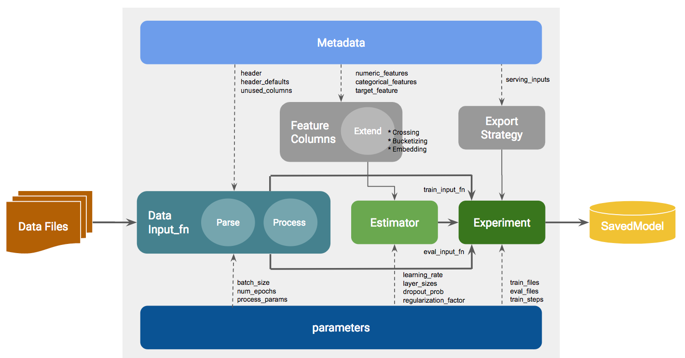

# TF Estimator Tutorials - TensorFlow v1.4

## The tutorials use synthetic (generated) data to cover:

01. Canned Estimators (Regression, Classification, Clustering, Time Series, Autoencoding, etc.)
02. Wide & Deep Classification and Regression Models - (handling dense and sparse feature columns)
03. Work with numeric and categorical input attributes
04. Feature Engineering (normalizer_fn, crossing, embedding, and bucketization, as well as custom logic during data input)
05. Experiment APIs (tf.contrib.learn.experiment) and tf.estimator.train_and_evaluate (trainSpec & evalSpec)
06. Data input (tf.estimator.inputs.pandas_input_fn, tf.train.string_input_producer, and tf.data.Dataset APIs)
07. Work with .csv and .tfrecords (tf.example) data files
08. Early Stopping (SessionRunHooks)
09. Serving (export_savedmodel)
10. Custom Estimators (model_fn & EstimatorSpec)

